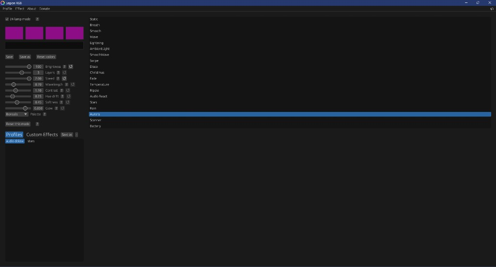

# Legion RGB Control for LOQ 15IRX10 <!-- omit in toc -->

[](https://github.com/Yazed-Hasan/L5P-Keyboard-RGB-LOQ-15IRX10-Support/releases)

[](https://github.com/Yazed-Hasan/L5P-Keyboard-RGB-LOQ-15IRX10-Support)

<div align="center">


Keyboard RGB control for the **Lenovo LOQ 15IRX10 (2025)**. Maintained by [Yazed Hasan](https://github.com/Yazed-Hasan). Forked from [4JX/L5P-Keyboard-RGB](https://github.com/4JX/L5P-Keyboard-RGB).

**These changes exist only to support the LOQ 15IRX10.** Other Legion / LOQ / Ideapad models are **not tested here**. If you have a different laptop, use the [original 4JX app](https://github.com/4JX/L5P-Keyboard-RGB) instead. I do not know if this fork still works on those machines.

</div>

## Index <!-- omit in toc -->

- [Download](#download)
- [How it works on the LOQ 15IRX10](#how-it-works-on-the-loq-15irx10)
- [How it talks to the hardware](#how-it-talks-to-the-hardware)
- [If the lights do not change](#if-the-lights-do-not-change)
- [4-zone vs 24-lamp mode](#4-zone-vs-24-lamp-mode)
- [Effects](#effects)
- [Usage](#usage)
- [Other models](#other-models)
- [Building from source](#building-from-source)
- [Crashes, freezes, etc](#crashes-freezes-etc)

## Download

**Use at your own risk. The developer is not responsible for any damage.**

This build is for the **LOQ 15IRX10 only**. I have not tested other keyboards.

Windows builds are uploaded to the [releases tab](https://github.com/Yazed-Hasan/L5P-Keyboard-RGB-LOQ-15IRX10-Support/releases). You can also grab the latest CI artifact from [Actions](https://github.com/Yazed-Hasan/L5P-Keyboard-RGB-LOQ-15IRX10-Support/actions/workflows/release-rust.yml) (GitHub account required): open the latest green run and download it from **Artifacts**.

LOQ 15IRX10 demo:

https://github.com/user-attachments/assets/a09962e2-3b82-4fd9-9e73-4aed728b06d7

## How it works on the LOQ 15IRX10

This laptop is **not** driven like older Legion 4-zone boards.

The keyboard is USB `048d:c693` (ITE / Lenovo). Windows owns it through **Windows Dynamic Lighting**. Legion Space is only an overlay on top. The keys also have a built-in FN+Space profile.

Close **Legion Space** before you start. Leave **Windows Dynamic Lighting** enabled.

Settings are saved next to the exe as `settings.json`. You can point that file somewhere else with the `LEGION_KEYBOARD_CONFIG` environment variable.

## How it talks to the hardware

This protocol write-up is for the **LOQ 15IRX10 only**. I have not checked other laptops.

The 15IRX10 keyboard exposes **two HID interfaces** on the same USB device:

| Interface | HID usage | What it is | What actually happens |
| --------- | --------- | ---------- | --------------------- |
| LampArray (Windows Dynamic Lighting) | page `0x0059`, usage `0x0001` | Standard Microsoft lighting API, **24 lamps** | This is the path that **visibly changes the keys** |
| Vendor (Lenovo) | page `0xff89`, usage `0x00cc` (usually MI_00) | Old Legion packet protocol (`0xCC` / `0x16` style, plus Gen7 profile commands like `0xCB` save) | Can open without lighting the board. Not used first |

### What the app does on start

When it sees PID `c693` it uses a dedicated LOQ path:

1. **Windows Dynamic Lighting (WinRT)** — `LampArray.FromIdAsync` on `VID_048D` / `PID_C693`. This is the default because it is the only API that reliably updates this keyboard.
2. **Raw HID LampArray** — open usage page `0x0059` ourselves, take host control, paint 24 lamps. Fallback only.
3. **Vendor HID** — open `0xff89` / `0x00cc` and send legacy packets. Last resort. HID-first can succeed and still leave the keys dark.

HID/vendor is tried first only if you set `LEGION_RGB_LOQ_HID_FIRST=1`.

It also stops Legion lighting helpers and writes `HKCU\Software\Microsoft\Lighting` so Legion Space is not sitting above this app.

### While the window is focused

Effects are **software frames**, not firmware effects.

```
GUI / effect thread
        │  4 zone colors  or  24 lamp RGB
        ▼
driver keepalive
        │
        ▼
Windows Dynamic Lighting (WinRT LampArray)
        │  24 lamp strips
        ▼
keyboard LEDs
```

- **4-zone mode** expands four `[R,G,B]` groups across the 24 strips.
- **24-lamp mode** sends a color per strip, like Legion Space custom themes.
- Brightness is 1–100% (Windows scale), not the old Legion 1/2 levels.
- A keepalive thread keeps pushing the last frame so Windows does not snap the lights back.

Older Legion 5 boards send a firmware effect ID (Static, Breath, Wave) over the vendor endpoint. This LOQ does not. Breath, wave, rain, aurora, audio, and the rest are all computed in the app, then painted as Static RGB.

### After you click away

WinRT LampArray is **focus-gated**. When another window is in front, Windows takes the keyboard back.

The app then hands the last colors to **Windows hold lighting** (`HKCU\Software\Microsoft\Lighting`: `Color`, `Color2`, `Brightness`, `EffectType`). Windows keeps a solid or simple gradient on the keys.

Vendor `SAVE_PROFILE` (`0xCB`) is **off by default**. Saving into firmware while WinRT still owns the LampArray made the keys flicker. Windows hold lighting is the unfocused path instead.

That is why you should:

- keep Dynamic Lighting **on**
- close Legion Space
- focus the app once so it can take the LampArray

### Why HID alone is not enough

Opening the vendor or LampArray HID handle on this model often returns success. The packets go out. The LEDs do not move. Windows already has exclusive access to the LampArray interface, so the app talks to Windows, and Windows talks to the hardware.

## If the lights do not change

1. Fully close Legion Space (tray icon too).
2. Open Windows Settings → Personalization → Dynamic Lighting. Toggle it **off**, then **on**.
3. Launch this app again and keep the window focused once so it can take control.
4. If it is still stuck, reboot, then repeat the toggle before opening the app.

Do not run this next to Legion Space, Vantage lighting, or another RGB tool. They will fight over the same keyboard.

## 4-zone vs 24-lamp mode

The LOQ 15IRX10 has **24 lamp strips**.

- **24-lamp mode off (default):** treats the keyboard as 4 zones. Lighter on CPU, closer to classic Legion RGB.
- **24-lamp mode on:** paints all 24 strips, like Legion Space custom themes. Waves, rain, aurora, and scanner look much better here.

Turn it on with the **24-lamp mode** checkbox at the top of the window.

## Effects

Pick an effect on the right. Colors, speed, and extra sliders sit on the left. **Reset this mode** only restores the effect you are looking at.

### Solid and stock

- **Static:** four zone colors, no motion.
- **Breath:** fades the current colors in and out.
- **Smooth:** cycles through a rainbow.
- **Wave:** built-in left/right wave.

### Motion

- **SmoothWave:** software wave across the keys. **Change** swaps colors as it moves. **Fill** paints the board, then clears it. **Clean with black** fades through black between fills.
- **Swipe:** same idea as SmoothWave, more of a hard wipe.
- **Lightning:** random sparks.
- **Disco:** random zone flashes.
- **Christmas:** red / green holiday pulse.
- **Ripple:** rings or waves from a point. Width, origin, and style are adjustable. In 24-lamp mode the ring hops strip by strip.
- **Stars:** twinkling night sky, optional shooting stars. Palettes: Custom, White, Gold, Rainbow, Random.
- **Rain:** drops with trails, splash, and wind. Palettes: Ice, Neon, Rainbow, Custom.
- **Aurora:** overlapping northern-light bands. **Borealis** is green-cyan, **Twilight** is purple, **Custom** uses your zone colors.
- **Scanner:** a moving beam with trail. Bounce or wrap, optional second beam. Palettes: Red, Ice, Rainbow, Custom.

### Reactive

- **AmbientLight:** samples the screen and copies those colors onto the keyboard. FPS and saturation are adjustable.
- **Audio React:** listens to Windows playback (WASAPI loopback). Sensitivity, smoothness, idle glow, per-band gain, color mode, and style (levels, pulse, wave, fire, ripple, and more).
- **Battery:** charge bar across the keys. Traffic palette is green / yellow / red. Pulses at the tip while charging.
- **Temperature:** cool-to-hot gradient from CPU temperature. Needs a readable sensor; on some Windows setups it may stay still.
- **Fade:** dims the keyboard after you stop typing / moving the mouse.

### Custom JSON effects

You can also load a `json` file of steps:

```json
{
  "effect_steps": [
    {"rgb_array": [0, 0, 0, 0, 100, 0, 0, 0, 0, 0, 0, 0], "step_type": "Set", "brightness": 1, "steps": 100, "delay_between_steps": 100, "sleep": 100},
    {"rgb_array": [0, 100, 0, 0, 0, 200, 0, 0, 200, 200, 0, 0], "step_type": "Transition", "brightness": 1, "steps": 100, "delay_between_steps": 100, "sleep": 100}
  ],
  "should_loop": true
}
```

- **rgb_array:** `[r,g,b,r,g,b,r,g,b,r,g,b]` for the four zones.
- **step_type:** `Set` jumps, `Transition` blends.
- **brightness:** `1` low, `2` high.
- **steps / delay_between_steps / sleep:** how fine the blend is, wait between intervals, and wait before the next step (ms).
- **should_loop:** start over at the end.

## Usage

Double-click the exe. For CLI extras plus the window, pass `--gui`.

```sh
legion-kb-rgb --help
legion-kb-rgb set -e Static -c 255,0,0,255,0,0,255,0,0,255,0,0
legion-kb-rgb set -e SmoothWave -s 4 -b 2 -d Left
```

### Advanced Windows flags

Only if you are comparing this app to Legion Space or USB captures:

```powershell
$env:LEGION_RGB_REVERSE_MODE = "1"       # extra HID logging in legion_rgb_debug.log
$env:LEGION_RGB_LOQ_HID_FIRST = "1"      # try HID/vendor before Windows Dynamic Lighting
$env:LEGION_RGB_LOQ_USE_LAMPARRAY = "1"  # mixed LampArray writes in the keepalive path
$env:LEGION_RGB_FORCE_VENDOR_ONLY = "1"  # vendor endpoint only (MI_00, usage 0xff89/0x00cc)
```

On the 15IRX10, HID-first can open the device and still leave the keys dark. Leave these unset unless you are debugging.

## Other models

**This fork is only for the LOQ 15IRX10 (`048d:c693`).** The Windows Dynamic Lighting path, 24-lamp mode, hold-lighting handoff, and Legion Space workarounds were added for that machine. I do not know what they do on other laptops.

For Legion 5, Ideapad Gaming 3, older LOQ, and anything else, use [4JX/L5P-Keyboard-RGB](https://github.com/4JX/L5P-Keyboard-RGB). That project is the one that actually supports those boards.

- **This repo:** LOQ 15IRX10 (2025), Windows. Tested by me.
- **Anything else:** untested here. No idea if it works, breaks, or does nothing.

USB IDs below are from the original project, for reference only. They are **not** a compatibility list for this fork.

| Year | Pro    | Regular + Slim | LOQ    |
| ---- | ------ | -------------- | ------ |
| 2025 |        |                | `c693` (this fork) |
| 2024 | `c995` | `c994`         | `c993` |
| 2023 | `c985` | `c984`         | `c983` |
| 2022 | `c975` | `c973`         |        |
| 2021 | `c965` | `c963`         |        |
| 2020 | `c955` |                |        |

## Building from source

Windows is the target for LOQ 15IRX10.

- [Rust](https://www.rust-lang.org/tools/install)
- [Git](https://git-scm.com/downloads)
- [VCPKG](https://github.com/Microsoft/vcpkg#getting-started) with `VCPKG_ROOT` set

```cmd
vcpkg update && vcpkg install libvpx:x64-windows-static libyuv:x64-windows-static aom:x64-windows-static
git clone https://github.com/Yazed-Hasan/L5P-Keyboard-RGB-LOQ-15IRX10-Support.git
cd L5P-Keyboard-RGB-LOQ-15IRX10-Support
cargo build --release
```

Or with `cargo-make`:

```sh
cargo install cargo-make
cargo make build-release
```

## Crashes, freezes, etc

No guarantees. This was tested on a LOQ 15IRX10. Open an issue on the [issues tab](https://github.com/Yazed-Hasan/L5P-Keyboard-RGB-LOQ-15IRX10-Support/issues) if that model breaks. For other models, please use the [original repo](https://github.com/4JX/L5P-Keyboard-RGB).

---

Maintained by [Yazed Hasan](https://github.com/Yazed-Hasan) for the **LOQ 15IRX10 only**. Based on [4JX/L5P-Keyboard-RGB](https://github.com/4JX/L5P-Keyboard-RGB). Other models are not tested.

Thanks to legendk95#0574 (272711294338072577) on Discord for the original keyboard reverse engineering.
